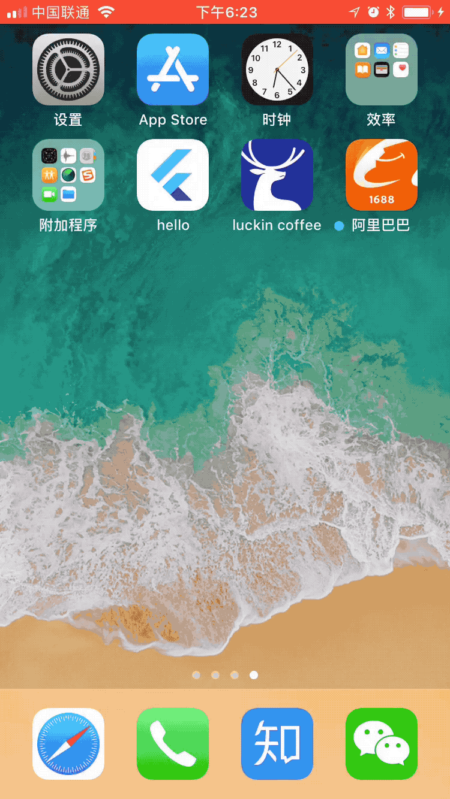

# hello

本项目为Flutter学习Demo,主要实现锤子文章阅读还有知乎热文以及专栏文章

# 以下功能点
1. 使用基本的布局加组件
2. 使用异步加载数据
3. 使用第三方依赖
4. 锤子文章API & 知乎热点文章查看
5. 下拉刷新
6. 图片懒加载

# 存在的问题
由于使用到HtmlView插件，部分HTML会解析失败。

# 第三方库

    cupertino_icons: ^0.1.0
    transparent_image: ^0.1.0
    flutter_webview_plugin: "^0.1.6"
    flutter_html_view: ^0.5.2
    carousel_pro: ^0.0.1

# 如何安装

1. 下载
2. flutter pub get
3. flutter run 或者正式版本安装 flutter run --release